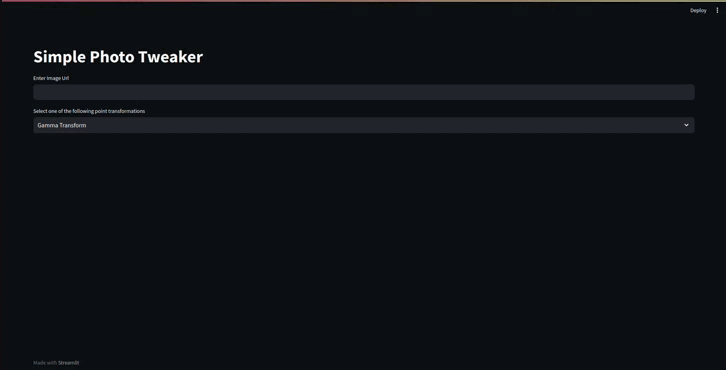

# Streamlit Image Transformation App

This is a simple Streamlit application that allows users to upload an image and apply various point transformations to enhance or modify the image.

## Features

- Upload an image from your local device or provide an image link.
- Apply point transformations to the image like gamma transform, Contrast Streching, Negative etc..
- View the transformed image along with Transformation Curve in real-time.
Contrast Streching
## Usage

1. Clone the repository:

   ```bash
   git clone https://github.com/m-baset/Streamlit-Image-Transformation-App.git
2. Change to the project directory:

   ```bash
   cd Streamlit-Image-Transformation-App
4. (Optional) Create and activate a Conda environment:

   ```bash
   conda create --name image-transform-app python=3.9
   conda activate image-transform-app

5. Install the required dependencies:

   ```bash
   pip install -r requirements.txt
6. Run the Streamlit app:
 
   ```bash
   streamlit run app.py
7. Open your web browser and access the app at http://localhost:8501.

## Point Transformations

Point transformations in image processing are fundamental operations that involve the manipulation of individual pixel values within an image. These transformations typically follow a mathematical function or rule that is applied uniformly to each pixel, without considering the surrounding pixels. The primary purpose of point transformations is to enhance, adjust, or modify various visual aspects of an image, such as brightness, contrast, color balance, and more.

## Demos


